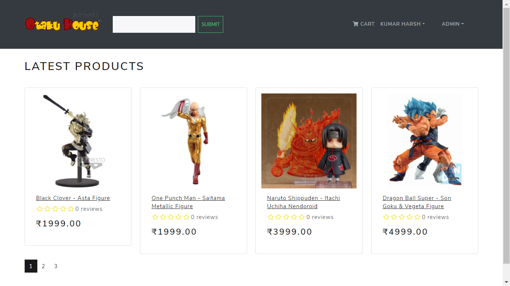
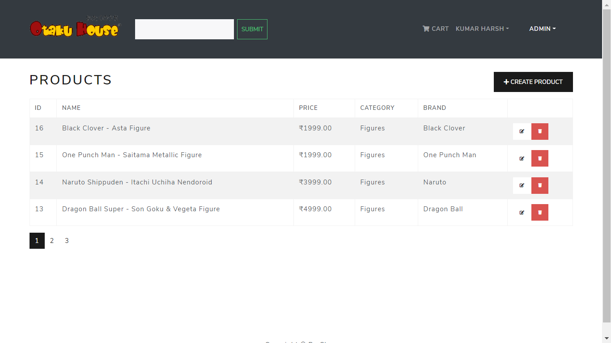
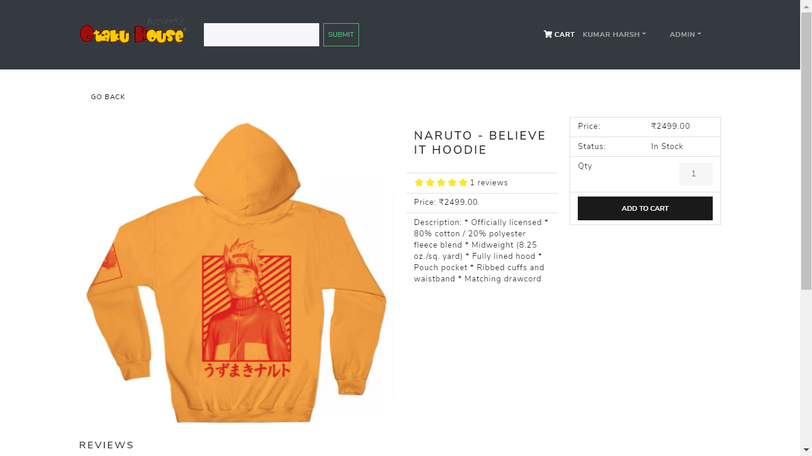
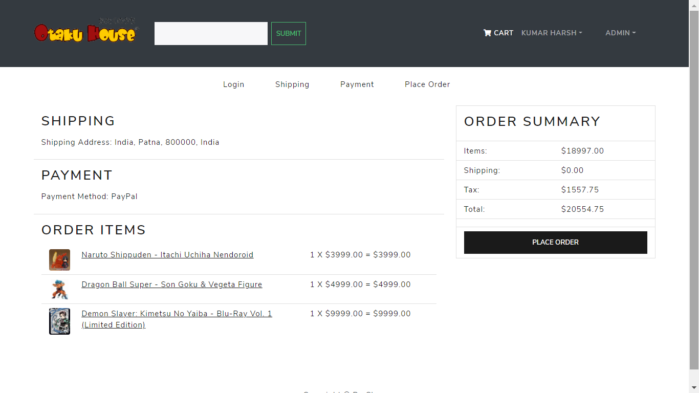

<h1 align=center>E-Commerce Website with Django + React & Redux</h1>
<h2 align=center>Otaku House</h2>

## ✨ [Live Link - Otaku House]

 **Home Page**  
  

- **Product Listing Page**  
  

- **Product Details Page**  
  

- **Cart Page**  
  

### How to Run 🏃‍♀️

```shell
1 Clone This Repo by `git clone https://github.com/kritebh/ecommerce-django-react.git`
2 python -m venv env
3 .\env\Scripts\activate
4 pip install -r requirements.txt 
5 python manage.py runserver
